 # Reusing the VFD of Belgacom Decoder V4 (aka Proximus TV) with Raspberry-Pi Pico and MicroPython

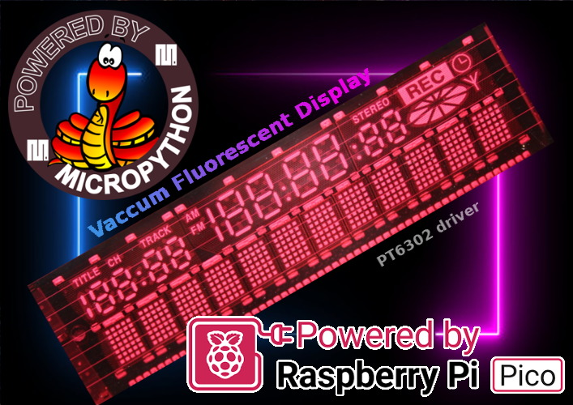

The initial __Belgacom\Proximus V4 decoder__ (Official Belgium IP TV) were using a Vaccum Fluorescent Display that can be reused within our own project.

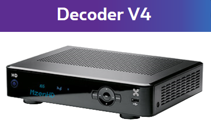

Once disassembled, we can access the front panel revealing the VFD, On/Off button, IR Sensor and buttons.

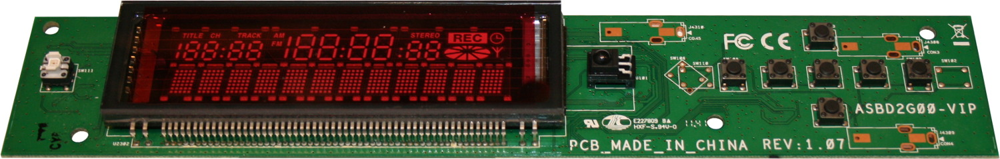

The display can show 12 digits and the many symbols are controled through the segments of 3 additionnal digits.

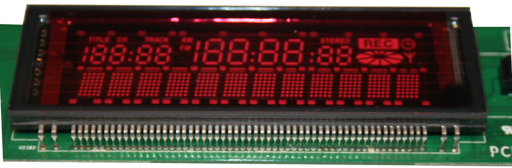
This page details the reuse of the VFD drived by a PT6302 VFD driver. Such driver can be used with a Raspberry-Pi Pico microcontroler under MicroPython

# About the Vaccum Fluorescent Display
It is important to understand how the VFD work before starting some hacking around it.

I Recomend you the reading of the [micropython-M66004-VFD github repository](https://github.com/mchobby/micropython-M66004-VFD). It contains comprehensive informations about how a VFD works.

__Ressources:__

* [PT6302 datasheet](docs/PT6302.pdf) - driver of this Vaccum Fluorescent Display
* [74LVC541A datasheet](74LVC541A.pdf) - 3 output states buffer (8 bits) used to access the buttons (not used with the display)

# The Belgacom Decoder Vaccum Fluorescent Display

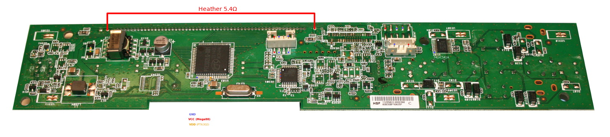

The back of the board revealed lots of components, including an mega88L microcontroler, the nice die for the PT6302 VFD driver.

__My wrong assumptions:__

The left part include a small transformer and a large inductance. I was expecting them to generates the High negative voltage for the grid  and the heater low voltage. Many traces do confirm it.

Unfortunately that circuit do not start at power-up and was not controled by the microcontroler Mega88. One or more external signals are required to make it working... I was unable to identify them (because of the hazardous component distribution laking retro-engineering task a nigntmare).

I was also expecting the mega88 microcontroler to control the PT6302 VFD driver. Once again, it was not the case... the mcu was probably there for decoding the IR receiver signal.

The only solution seems to takes the control of the PT6302 driver.

# Desoldering unused components
In order to take the control of the PT6302, it will ne necessary to remove all unused (not useful component).

As you can see on the picture below, I do removed every components from the control button section (excluded) to the left PCB edge! I do only preserve the PT6302 and immediate components.

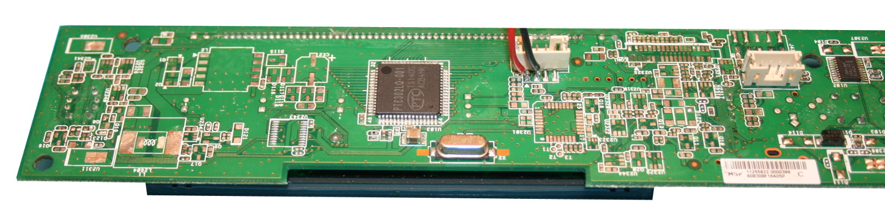

From [previous experience](https://github.com/mchobby/micropython-M66004-VFD), I did extract the "PT6302 application diagram" and add useful annotation.

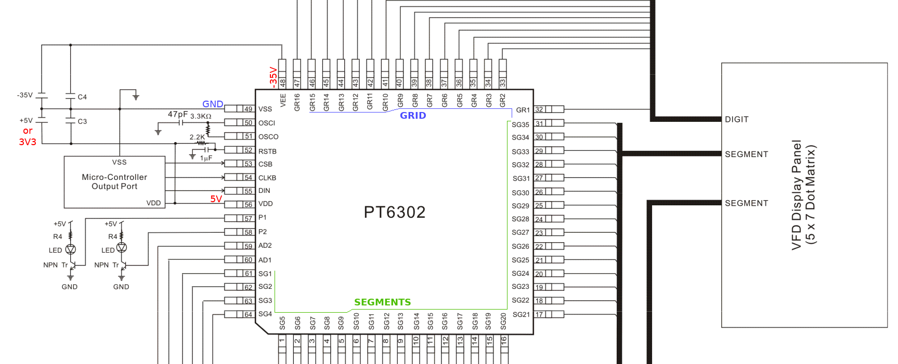

Here are the various voltages involved into the PT6302 wiring:

* __VDD__: 5V Logic Voltage.
* __VEE__: Negative voltage used to fix the potential of heater filament (-25 to -35 volts)
* __VSS__: common ground.
* __RSTB__: Reset the driver
* __CSB__: Chip Selection. Put it low to communicate with the chip.
* __CLKB__: Clock signal. Data is acquired on the rising edge.
* __DIN__: Data Input. Data is sent bit by bit (LSBF).

__Here some additional note regarding this setup__:

1. Even if this work in 3.3V logic, I opted for __5V Logic__ (for commodity) and a 74HCT125 Level Shifter.
2. The Heather resistance have 5.4Ω, So, the voltage must be lower... if we do apply 5V then the heating current will reach 1 AMPs!. I started the heater at 2V and discover that __2.9V (~3V) was pretty fine__ (with a heater current of 140mA).
3. The initial **VEE voltage** of -35V was a good starting point but finally **reduce it to -25V** (which significantly reduce the heat dissipation in the cutoff bias voltage assembly).
4. By removing all the components, I did also removed the Bias "__Cutt-Off Voltage circuitery__" will will have to use Zener Diode and resistor to recreate it!

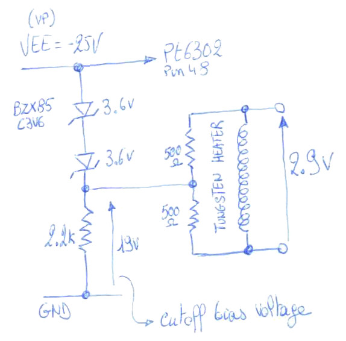

# Digits localisation
Digits 1 to 3 are used for symbol lightning. Text writing starts at digit 4  (for 12 alphabetical digits).

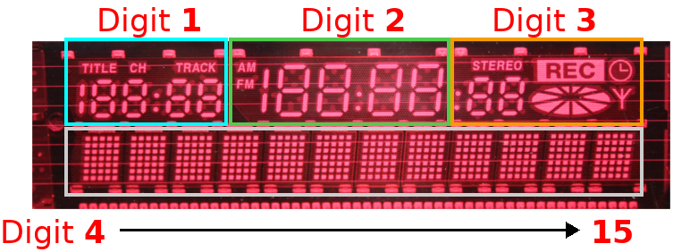

Each digit is made of 35 segments (numbered from 0 to 34) and can be controled individually thanks to a character defined within RAM (namely CGRAM in the datasheet). 

The examples contains code explains how to perform that.

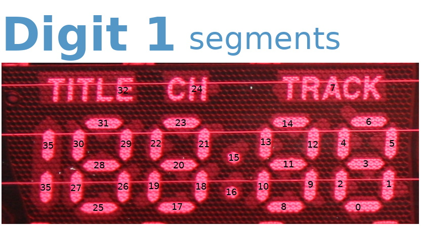

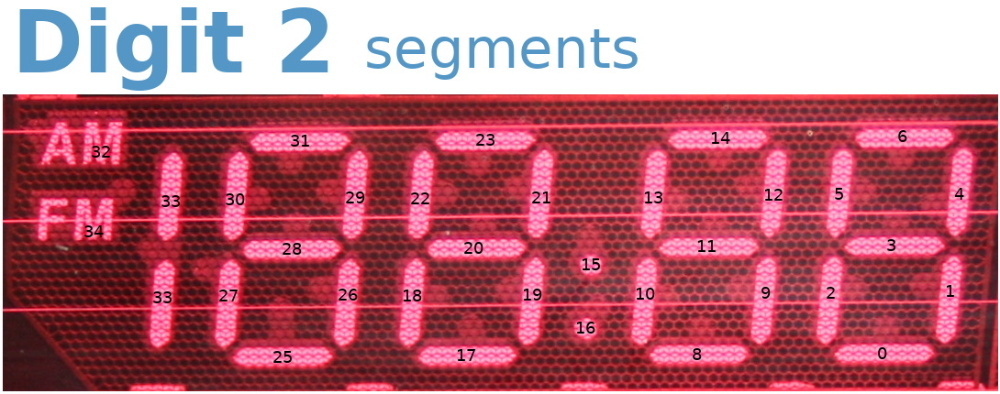

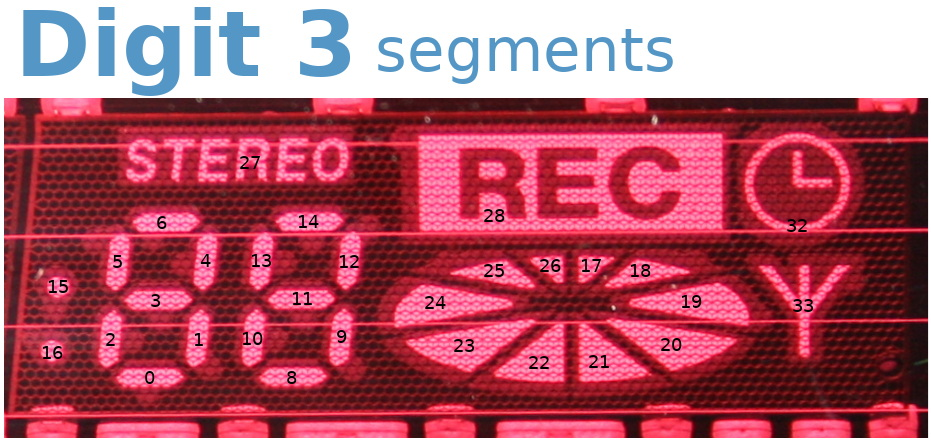

# Wiring
First thing first, We must retreive all the required signal on the back of the PCB.

As the 5V power supply has been moved next to the PT6302 (it was necessary).

The __DIN signal must solder directly on the chip pin__! It is a very precise and difficult operation (use a resistor leg to create the former connection point on the chip).
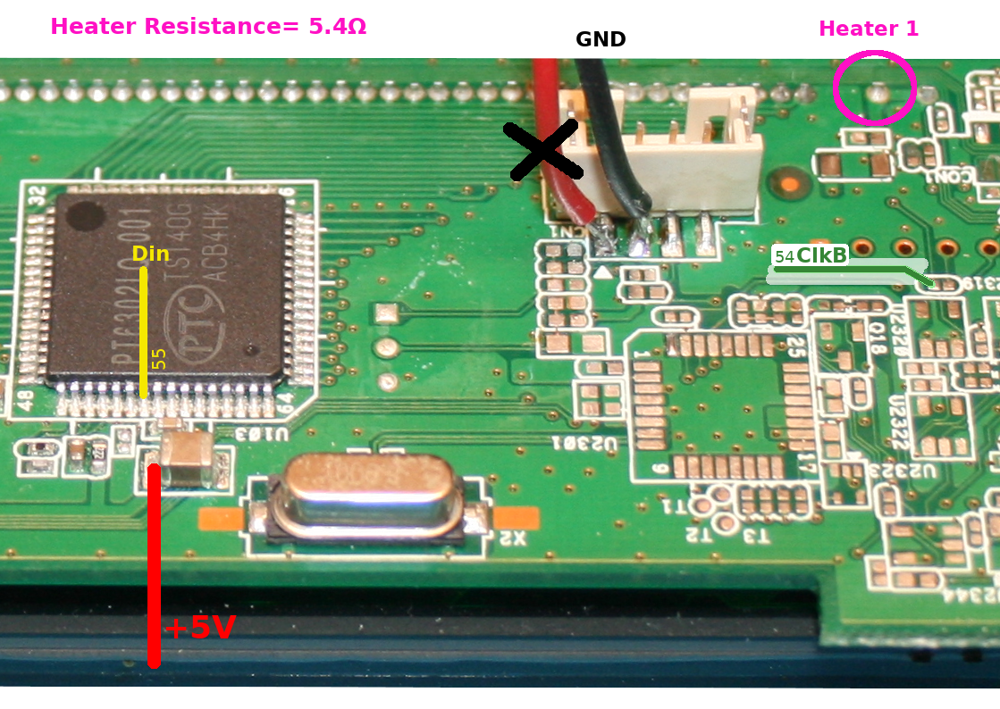

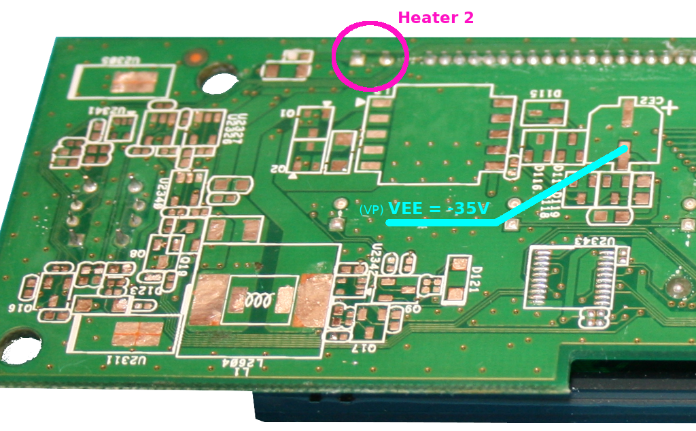

We need to remove two components next to the PT6302 chip to disable the Power-On-Reset feature. It is necessary to get the full control over the Reset signal. Click on the picture to enlarge.

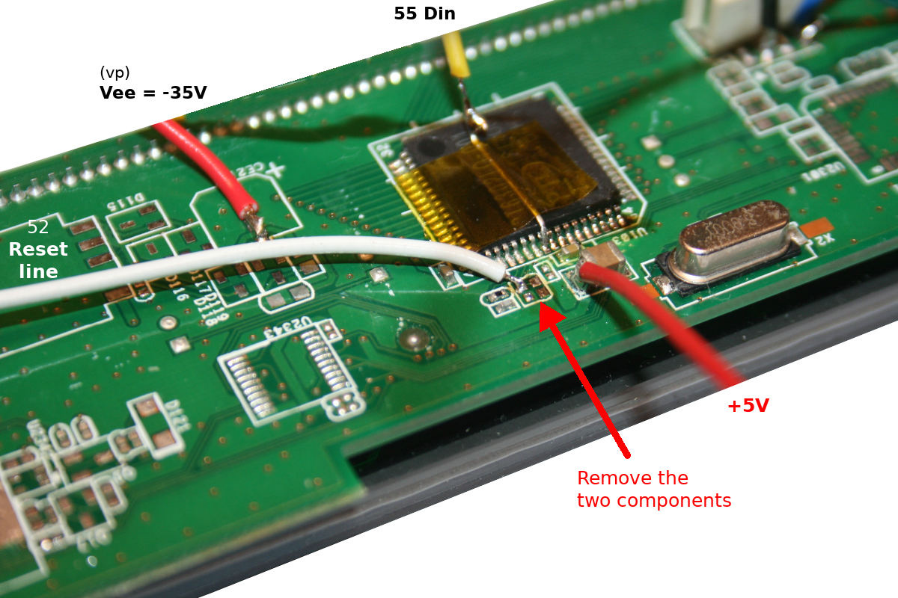

The chip-select signal is a very little spot (however larger than a chip leg). Click on the picture to enlarge.

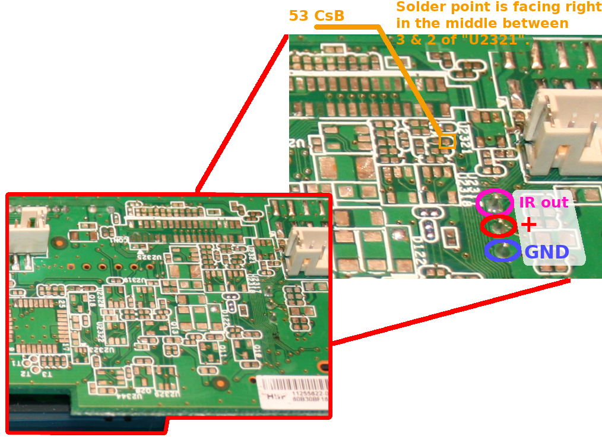

Finally, we can wire the LCD on the screen as follow:

Next, just wire the VFD display to the Pico and required power suppiies.

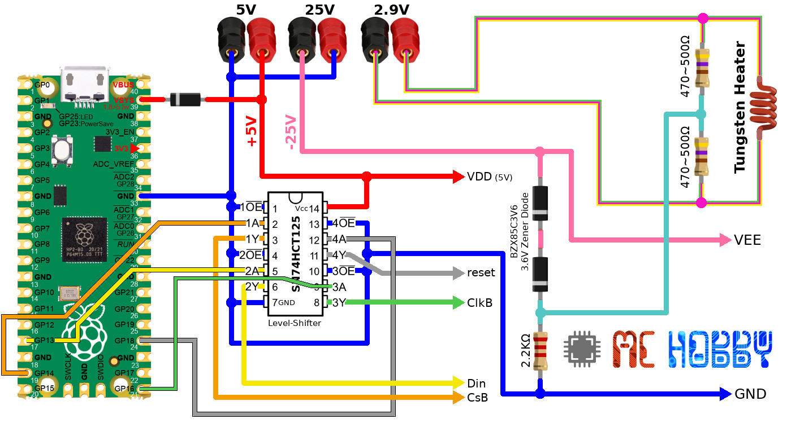

# Library
## vfd_pt63 generic library
The library [lib/vfd_pt63.py](lib/vfd_pt63.py) is a generic library to handle the PT6302 driver chipset. 

It allows to:

1. draw ROM char into one of the display digits (from 1 to 16). 
2. define CUSTOM CHAR into the RAM (for reserved char from RAM1 to RAM16).
3. manipulate --on the fly-- each segments (from 0 to 34) of a CUSTOM CHAR.

# Generic examples

Generic examples are based on thr [lib/vfd_pt63.py](lib/vfd_pt63.py) generic library.

## Display All
The first example written for this setup was [test_display_all.py](examples/test_display_all.py) which light up all the segments of the display. It is a good starting point to test the power connexion + bus communication.

The example declare a length of 15 digits (the maximum for the Belgacom/Proximus display). Some of them are real digits showing chars while other are wired to disc/volume/play/etc symbols.

``` python
from machine import Pin
from vfd_pt63 import VFD_PT6302

_reset = Pin(Pin.board.GP18, Pin.OUT, value=True ) # Unactive
_cs = Pin( Pin.board.GP14, Pin.OUT, value=True ) # unactiva
_sdata = Pin( Pin.board.GP13, Pin.OUT )
_sck = Pin( Pin.board.GP16, Pin.OUT, value=True )

vfd =VFD_PT6302( sck=_sck, sdata=_sdata, cs=_cs, reset=_reset )
vfd.digit_length( 15 )
vfd.all_digit_on( )
```

Once executed the display should activate all the segments.

## Print a string
To display a string, we have to the set the position of the initial char to write then sending the binary data with the ASCII code of the characters to be displayed (those are binary data with ordinal value of the character to print. in ASCII "A"" equal 65).

If the auto-increment is set up then all following chars will also be displayed.

``` python
from machine import Pin
from vfd_pt63 import VFD_PT6302

_reset = Pin(Pin.board.GP18, Pin.OUT, value=True ) # Unactive
_cs = Pin( Pin.board.GP14, Pin.OUT, value=True ) # unactiva
_sdata = Pin( Pin.board.GP13, Pin.OUT )
_sck = Pin( Pin.board.GP16, Pin.OUT, value=True )

vfd =VFD_PT6302( sck=_sck, sdata=_sdata, cs=_cs, reset=_reset )

# First character of the display is at Digit #4
vfd.display_digit( 4, "ABCDEFGHIJKL" )

# ASCII code can also be sent to the screen
# vfd.clear()
# vfd.display_digit( 6, [123,119,120,121,122,125] ) # {wxyz}
```

Notice that `s.encode('ascii')` do generate a bytes type (a binary array).

## Light up a symbol
Let's say we wantt to light-up the "stereo", the clock and the antenna on the Digit 3.


To do this, we will light-up the segment 27, 32 and 33.

``` python
from machine import Pin
from vfd_pt63 import VFD_PT6302, RAM7
import time

_reset = Pin(Pin.board.GP18, Pin.OUT, value=True ) # Unactive
_cs = Pin( Pin.board.GP14, Pin.OUT, value=True ) # unactiva
_sdata = Pin( Pin.board.GP13, Pin.OUT )
_sck = Pin( Pin.board.GP16, Pin.OUT, value=True )

vfd =VFD_PT6302( sck=_sck, sdata=_sdata, cs=_cs, reset=_reset )

# Attach the custom RAM7 to first character 
segments = vfd.attach_digit( 3, RAM7 )

for i in (27, 32, 33 ): # segments to light-up
	segments.set( i, True )

segments.update()
print( 'Done!' )
```

## Other examples
Navigates the [examples](examples) folder to find other documented example files.

# Proximus TV examples
The [vfd_proximus.py](lib/vfd_proximus.py) library expand the basic driver  vfd_pt63.py . 

That library includes extra features/capability for the Proximus TV / Belgacom TV VFD. Related examples are stored into the [examples/ProximusTV](examples/ProximusTV) folder.


What can you expect from __vfd_proximus__ library ?

* The higher level `VFD_Proximus` class use to access all the parts of the display.
* the `print()` method that immedialety displays a string on the bottom part  of the display. The `clrscr()` method immediately erase the text displayed. See [test_prox_basic.py](examples/ProximusTV/test_prox_basic.py) example.
* the `options` property to immediately turn on/off a symbol on the display with the constants `TITLE,CHANNEL,TRACK,STEREO,RECORD,CLOCK,ANTENNA,AM,FM` . See [test_prox_basic.py](examples/ProximusTV/test_prox_basic.py) example.
* The `left` , `center`, `right` properties are used to access the panels respectively labelled "Digit 1", "Digit 2" and "Digit 3" on the image above. The panels control the various segments forming numbers on the panel.
* The `left` and `center` panel barely support identical `DigitalPanel` class features where the right `DiscPanel` also manage some disc animation on the display.
* The panels expose a `separator` property that can be set to `DOT, COLON, None`. See [test_prox_digits.py](examples/ProximusTV/test_prox_digits.py) example.
* All the panels can manipulates digit and show numbers (before and after the separtor). See [test_prox_digits.py](examples/ProximusTV/test_prox_digits.py) example.
* The DigitalPanel (so left and center panel) can display __integer and float numbers__. See [test_prox_int.py](examples/ProximusTV/test_prox_int.py) and [test_prox_float.py](examples/ProximusTV/test_prox_float.py) examples.
* The DiscPanel (right panel) can display __nice disk spinning animation__ (with positive or negative behavior). See [test_prox_disc.py](examples/ProximusTV/test_prox_disc.py) and [test_prox_disc2.py](examples/ProximusTV/test_prox_disc2.py) examples.

Finally, don't miss the [test_prox_time.py](examples/ProximusTV/test_prox_time.py) example that displays the time on the VFD display.